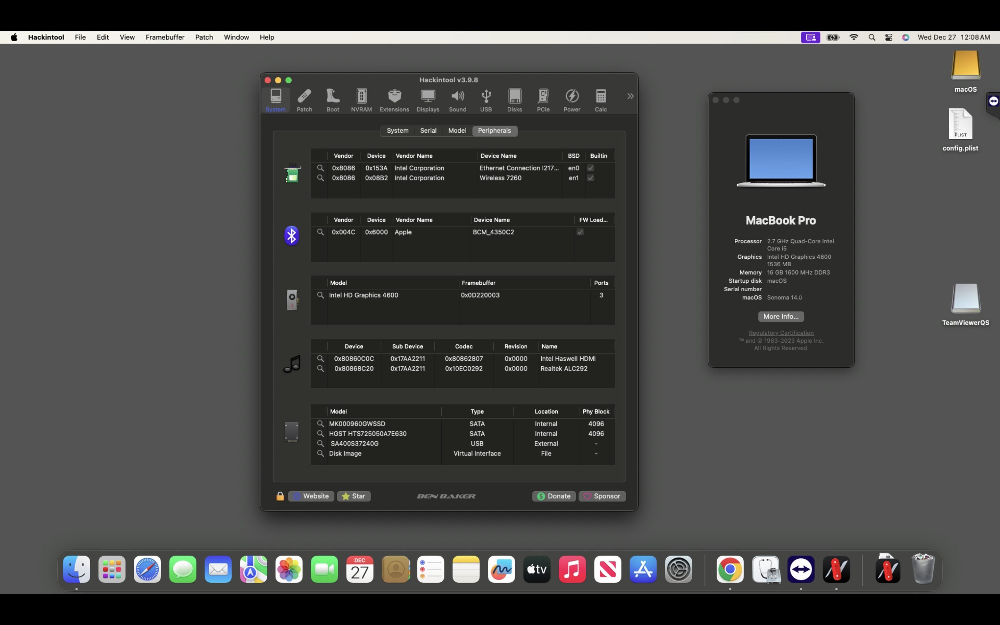
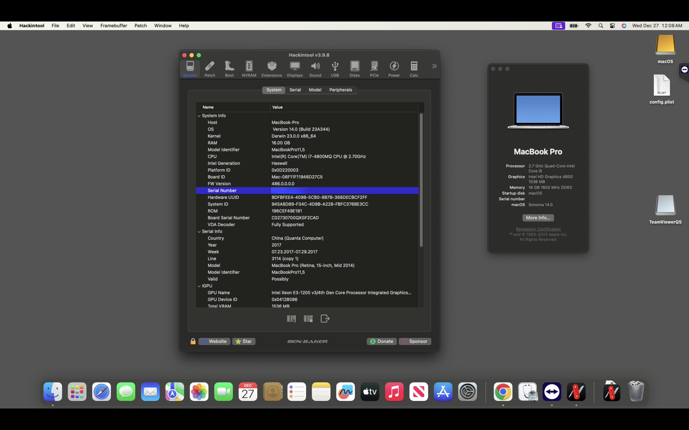

# macOS SONOMA on Lenovo Thinkpad W541

## Specifications:
- **CPU:** 	i7 – 4800MQ
- **iGPU:** 	 	 HD4600
- **dGPU:** 	 	 K2100M
- **RAM:** 16GB
- **Ethernet:** 	
- **Sound Card:** 	
- **Disk Drive:**
- **Wifi/ Bluetooth:** Intel

## Whats workin'
* iGPU (Using OpenCore Legacy Patcher to patch)
* All USB ports
* Ethernet
* Audio 
* CPU Power Management
* Wifi/ Bluetooth
* etc...

## Whats not workin'
* dGPU

# Screenshot:

## Credits
- [Apple](https://apple.com) for macOS.
- [Acidanthera](https://github.com/acidanthera) for OpenCore and all the lovely hackintosh work.
- [corpnewt](https://github.com/corpnewt/gibMacOS) For great guides and offline installer.
- [Dortania](https://dortania.github.io/OpenCore-Install-Guide) For great and detailed guides.
- [VNOHackintosh](https://facebook.com/VNOHackintosh) Support group for installation and post installation.
- [OCLP](https://github.com/dortania/OpenCore-Legacy-Patcher) Patch Graphics for HD4600
